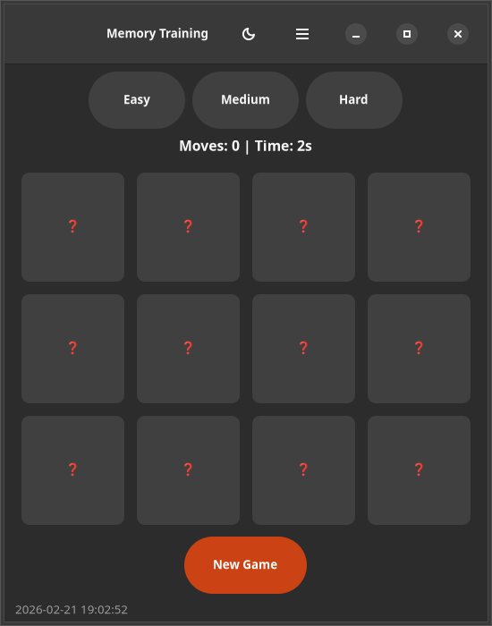
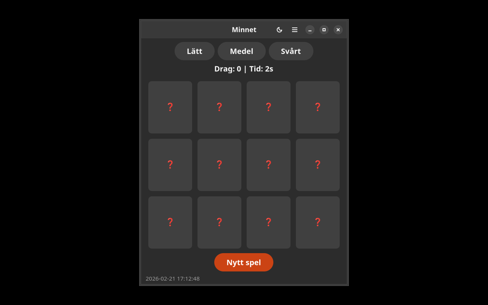

> **⚠️ This app has been migrated to the Autismappar PWA at https://autismappar.se**

# Minnet

Working memory training games for autism and ADHD.

Built with GTK4/Adwaita. Part of the [Danne L10n Suite](https://github.com/yeager/debian-repo).

## Installation

### Debian/Ubuntu
```bash
sudo apt install minnet
```

### Fedora/RPM
```bash
sudo dnf install minnet
```

## License

GPL-3.0

## Author

Daniel Nylander — [danielnylander.se](https://danielnylander.se)

## Screenshots



